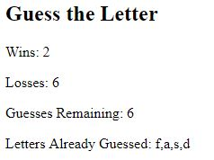

# Psychic Game

## Summary
This is my psychic game created using javascript.

## Site Pictures


## Technologies Used 
- HTML - Used to create elements on the DOM
- JS - Used to manipulate content on HTML
- Git - version control system to track changes to source code
- Github - hosts repository that can be deployed to GitHub pages

## Code Snippet
The following code shows the onkeypress javascript function used to track the users key presses.
```js
document.onkeypress = function (guess) {
    
    var selectedLetter = guess.key;

}
```

## Author Links
https://github.com/hagoodj